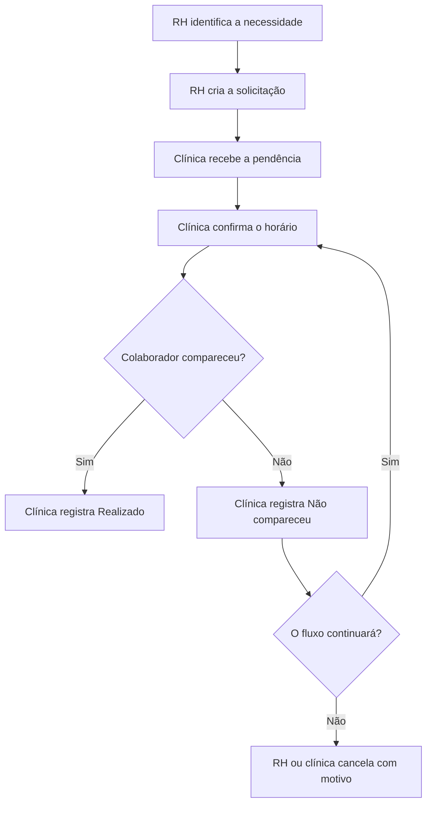
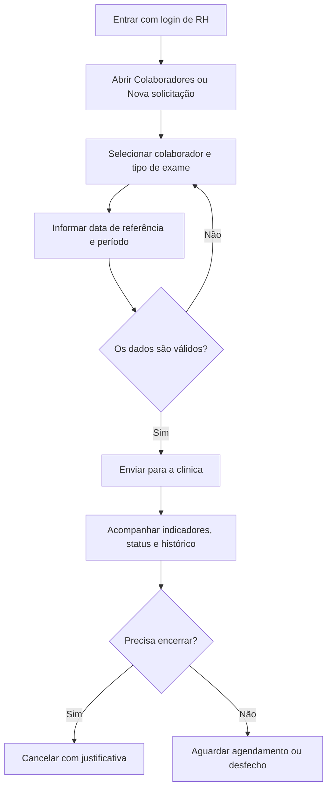
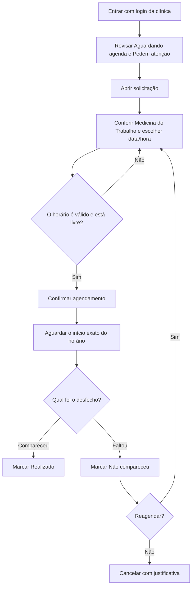
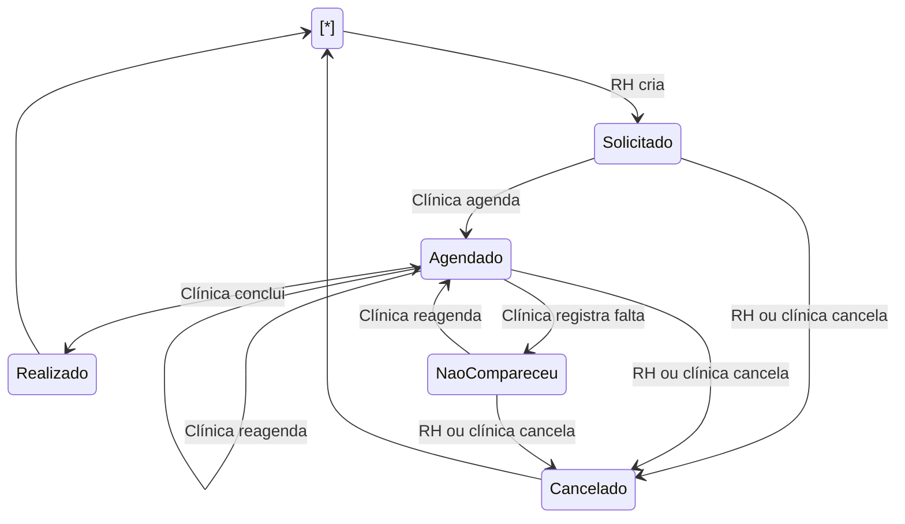
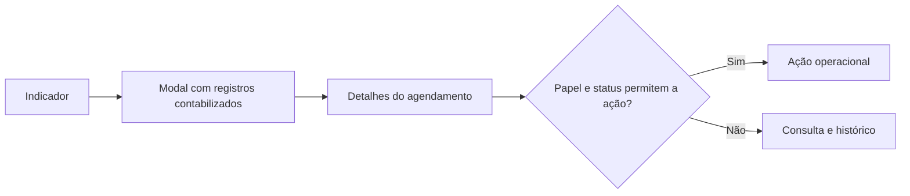
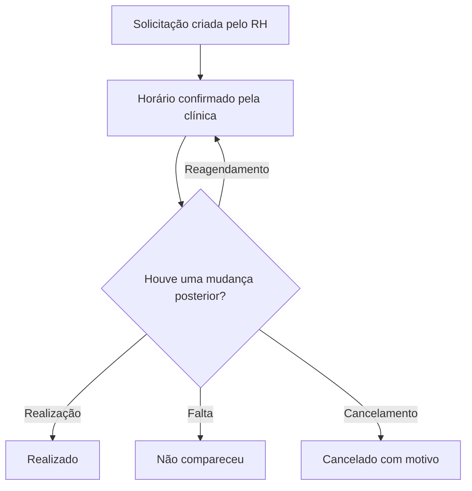
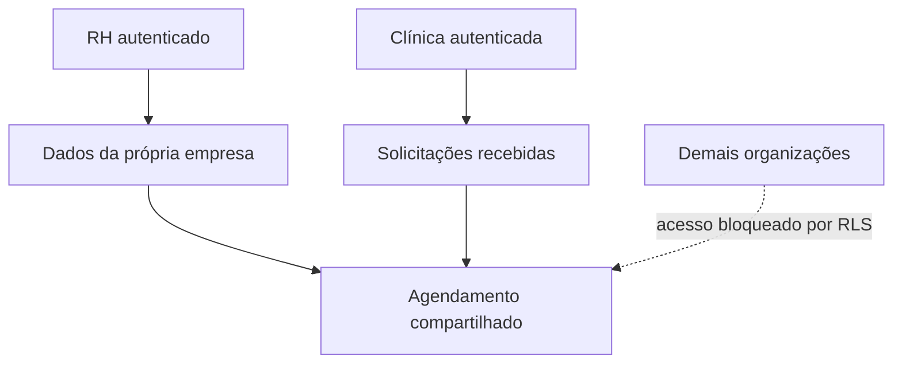

# Ciclo — README de negócio

Documentação funcional do **Ciclo**, com o objetivo do produto, responsabilidades do RH e da clínica, estados, regras, exceções e fluxos operacionais.

> Este documento explica o que o sistema faz e por quê. Para stack, Clean Architecture, banco, instalação e comandos, consulte o \[README técnico](./README-TECNICO.md).

## Sumário

* [Visão do produto](#visão-do-produto)
* [Escopo](#escopo)
* [Participantes](#participantes)
* [Fluxo completo](#fluxo-completo)
* [Fluxo do RH](#fluxo-do-rh)
* [Fluxo da clínica](#fluxo-da-clínica)
* [Estados do agendamento](#estados-do-agendamento)
* [Regras por tipo de exame](#regras-por-tipo-de-exame)
* [Regras de prazo e horário](#regras-de-prazo-e-horário)
* [Indicadores e telas](#indicadores-e-telas)
* [Cancelamento, falta e reagendamento](#cancelamento-falta-e-reagendamento)
* [Histórico e sincronização](#histórico-e-sincronização)
* [Privacidade e isolamento](#privacidade-e-isolamento)
* [Cenários de negócio](#cenários-de-negócio)
* [Limites do MVP](#limites-do-mvp)
* [Glossário](#glossário)

## Visão do produto

O Ciclo organiza a passagem de responsabilidade entre uma empresa e uma clínica de saúde ocupacional:

1. o RH identifica que um colaborador precisa de um exame;
2. a empresa envia uma solicitação com prazo e contexto administrativo;
3. a clínica recebe a demanda e define um horário em sua agenda;
4. a partir da data e hora marcadas, a clínica registra o desfecho operacional;
5. o RH acompanha o estado e o histórico sem acessar conteúdo médico.

O objetivo do MVP é tornar esse ciclo rastreável, reduzir pedidos perdidos e destacar prazos que exigem ação.

## Escopo

### Incluído

* autenticação separada para RH e clínica;
* identificação do papel e da organização pelo login;
* cadastro demonstrativo de colaboradores e uma agenda ativa da clínica, chamada **Medicina do Trabalho**;
* solicitação de exames ocupacionais pelo RH;
* agendamento e reagendamento pela clínica;
* registro de realizado ou não comparecimento;
* cancelamento com justificativa;
* consulta de detalhes e histórico operacional;
* indicadores clicáveis que mostram os registros contabilizados;
* filtros, busca e ordenação por prioridade;
* alertas de prazo;
* bloqueio de agendamentos aos sábados e domingos;
* grade de horários livres em intervalos fixos de 30 minutos;
* atualização automática entre empresa e clínica;
* isolamento dos dados por organização.

### Deliberadamente fora do escopo

* prontuário;
* diagnóstico;
* resultado médico;
* aptidão ou inaptidão;
* emissão e armazenamento de ASO;
* exames complementares e laudos anexos;
* documentos médicos;
* faturamento e cobrança;
* mensagens externas por e-mail ou WhatsApp;
* gestão completa de expediente, feriados e bloqueios recorrentes;
* distribuição de uma solicitação entre várias clínicas.
* regras de precedência e encadeamento entre exames ou etapas ocupacionais, como condicionar um novo agendamento à conclusão de uma etapa anterior ou ao cumprimento de determinado prazo.

No Ciclo, **Realizado** quer dizer que o atendimento foi concluído no fluxo administrativo. Não significa aptidão clínica.

## Participantes

### Papéis

|Papel|Representa|Responsabilidade central|
|-|-|-|
|RH|Empresa solicitante|Informar a necessidade ocupacional e acompanhar o atendimento|
|Clínica|Organização prestadora|Organizar a agenda e registrar o desfecho operacional|

Cada login pertence a uma organização. O usuário não escolhe manualmente entre RH e clínica: o perfil vem do cadastro associado à autenticação.

### Áreas disponíveis

|Área|RH|Clínica|Finalidade|
|-|:-:|:-:|-|
|Visão geral|Sim|Sim|Indicadores, prioridades e próximos atendimentos|
|Agendamentos|Sim|Sim|Lista, busca, filtros e detalhes dos registros autorizados|
|Colaboradores|Sim|Não|Consultar equipe e solicitar exame|
|Agenda clínica|Não|Sim|Organizar pendências e atendimentos confirmados|
|Configurações|Sim|Sim|Identidade e preferências visuais do perfil|

### Matriz de ações

|Ação|RH|Clínica|Por quê|
|-|:-:|:-:|-|
|Criar solicitação|Sim|Não|A necessidade nasce na relação de trabalho|
|Ver solicitação, prazo e histórico|Sim|Sim|Os dois participantes precisam acompanhar o mesmo processo|
|Definir horário|Não|Sim|A clínica controla a própria agenda|
|Reagendar|Não|Sim|A alteração precisa respeitar disponibilidade da clínica|
|Marcar como realizado|Não|Sim|A clínica confirma a execução do atendimento|
|Registrar não comparecimento|Não|Sim|A clínica observa a presença no horário|
|Cancelar com motivo|Sim|Sim|Empresa ou clínica podem ter uma razão operacional para encerrar|
|Alterar dados de origem do pedido|Não|Não|Colaborador, tipo, referência e participantes são imutáveis depois da criação|

## Fluxo completo

Em qualquer etapa aberta, RH e clínica consultam o mesmo registro, mas cada um vê apenas as ações que lhe cabem. `Realizado` e `Cancelado` encerram o fluxo.

## Fluxo do RH

### Objetivo do RH

Garantir que a necessidade ocupacional seja encaminhada com os dados administrativos corretos e acompanhar o atendimento até um desfecho.

### Jornada do RH

### Passo a passo do RH

1. **Entrar no sistema** com um usuário de RH.
2. Abrir **Colaboradores** e clicar em **Solicitar exame**, ou usar **Nova solicitação** no cabeçalho.
3. Selecionar o colaborador.
4. Selecionar o tipo de exame.
5. Informar a data de referência exibida para aquele tipo.
6. Em retorno ao trabalho, informar os dias de afastamento.
7. Escolher o período preferido: manhã, tarde ou qualquer período.
8. Acrescentar somente observações administrativas, se necessário.
9. Enviar a solicitação.
10. Acompanhar a mudança de `Solicitado` para `Agendado`.
11. Consultar horário, clínica, agenda e histórico em **Ver detalhes**.
12. Acompanhar o desfecho `Realizado`, `Não compareceu` ou `Cancelado`.

### O que o RH não faz

* não escolhe nem altera o horário da agenda da clínica;
* não confirma nem muda o horário;
* não registra presença ou falta;
* não acessa a agenda interna da clínica;
* não altera uma solicitação depois de enviada;
* não registra nem visualiza informação médica.

Se a origem do pedido estiver errada, o comportamento seguro é cancelar com motivo e abrir uma nova solicitação correta. Isso preserva a rastreabilidade.

## Fluxo da clínica

### Objetivo da clínica

Transformar solicitações recebidas em atendimentos organizados e informar o desfecho operacional à empresa.

### Jornada da clínica

### Passo a passo da clínica

1. **Entrar no sistema** com um usuário da clínica.
2. Abrir **Agenda clínica** ou clicar no indicador **Aguardando agenda**.
3. Priorizar solicitações pelo prazo mais próximo.
4. Abrir a solicitação para conferir colaborador, empresa, exame, preferência e prazo.
5. Conferir a agenda automática **Medicina do Trabalho**.
6. Escolher data e hora dentro do prazo na primeira marcação.
7. Confirmar o horário.
8. Se necessário antes do desfecho, abrir os detalhes e reagendar; a ação permanece disponível enquanto o fluxo estiver aberto.
9. Quando a data **e a hora exata de início** chegarem, registrar **Realizado** ou **Não compareceu**.
10. Em caso de falta, reagendar para uma nova data futura ou cancelar com justificativa, mesmo que o prazo original já tenha encerrado.
11. Consultar a linha do tempo para verificar quem realizou cada ação.

### O que a clínica não faz

* não cria a necessidade ocupacional em nome do RH;
* não cadastra nem gerencia a equipe da empresa neste MVP;
* não altera tipo de exame, data de origem ou empresa depois da solicitação;
* não vê colaboradores sem relação com um agendamento encaminhado a ela;
* não registra prontuário, diagnóstico, ASO ou resultado clínico.

## Estados do agendamento

### Significado dos estados

|Estado|Significado|Próximas ações válidas|
|-|-|-|
|`Solicitado`|RH enviou a demanda, ainda sem horário|Clínica agenda; RH ou clínica cancela|
|`Agendado`|Agenda, início e fim foram confirmados|Clínica pode reagendar; realizado/falta dependem do início; participantes podem cancelar|
|`Não compareceu`|Clínica registrou ausência após o início|Clínica reagenda; RH ou clínica cancela|
|`Realizado`|Atendimento encerrado administrativamente|Consulta apenas|
|`Cancelado`|Fluxo encerrado com justificativa|Consulta apenas|

### Ações por status, perfil e momento

|Estado e momento|Clínica|RH|
|-|-|-|
|`Solicitado`, dentro do prazo|Definir horário ou cancelar|Acompanhar ou cancelar|
|`Solicitado`, prazo encerrado|Cancelar; o primeiro horário fica bloqueado|Acompanhar ou cancelar e, se necessário, abrir uma nova solicitação válida|
|`Agendado`, antes do horário de início|Reagendar ou cancelar; botões de desfecho aparecem desabilitados|Acompanhar ou cancelar|
|`Agendado`, a partir do horário de início|Reagendar, cancelar, marcar `Não compareceu` ou `Realizado`|Acompanhar ou cancelar|
|`Não compareceu`|Reagendar ou cancelar, inclusive depois do prazo original|Acompanhar ou cancelar; não escolhe o novo horário|
|`Realizado` ou `Cancelado`|Somente consulta e histórico|Somente consulta e histórico|

Essa matriz descreve tanto os botões exibidos na interface quanto as permissões efetivamente validadas pelo banco. Ocultar ou desabilitar uma ação no navegador não é a única proteção.

### Regras de transição

* não é possível marcar `Solicitado` diretamente como `Realizado`;
* não é possível registrar falta sem horário confirmado;
* `Realizado` e `Não compareceu` só ficam disponíveis quando o instante completo do início — data e hora — já chegou;
* `Realizado` e `Cancelado` são estados finais;
* reagendar mantém o mesmo registro e o mesmo histórico;
* a transição é validada na aplicação e novamente no banco.

Exemplo: para um atendimento marcado às `10:00`, os dois desfechos permanecem desabilitados às `09:59` e ficam disponíveis a partir das `10:00`. Se o registro continuar `Agendado`, eles também permanecem disponíveis nos dias seguintes para que a clínica regularize o desfecho.

## Regras por tipo de exame

O campo de data muda de significado conforme o exame. Isso evita usar “data de admissão” para todos os casos.

|Tipo|Campo apresentado ao RH|Orientação|Data limite calculada|
|-|-|-|-|
|Admissional|Data prevista para início das atividades|Realizar até o início das atividades|A própria data informada|
|Periódico|Data limite definida pelo PCMSO|Usar o limite previsto no programa ocupacional|A própria data informada|
|Retorno ao trabalho|Data prevista para retorno|Informar o primeiro dia previsto para o retorno|A própria data informada|
|Mudança de risco|Data prevista para mudança de risco|Informar quando começa a exposição ao novo risco|A própria data informada|
|Demissional|Data de término do contrato|Prazo operacional de dez dias corridos|Data informada + 10 dias|

### Retorno ao trabalho

O fluxo exige a quantidade de dias de afastamento e só aceita **30 dias ou mais**. Se o afastamento for menor, o pedido é recusado como retorno ao trabalho neste recorte.

### Demissional

A data de término do contrato pode estar no passado somente enquanto o prazo operacional de dez dias ainda estiver aberto. Se os dez dias já terminaram, a solicitação é bloqueada.

O sistema não decide eventual dispensa do exame por exame recente, grau de risco ou outra hipótese normativa. Essa decisão permanece com profissionais responsáveis e com o RH.

## Regras de prazo e horário

### Data da solicitação

* uma data inválida é recusada;
* exames não demissionais não aceitam referência no passado;
* demissional aceita término passado apenas dentro dos dez dias;
* a data limite precisa corresponder ao tipo de exame;
* uma solicitação aberta equivalente não pode ser duplicada.

### Agendamento

* somente a clínica responsável pode agendar;
* a data precisa ser de segunda a sexta-feira;
* o expediente fixo deste MVP vai das `08:00` às `18:00`;
* início e fim são obrigatórios;
* o fim precisa ser posterior ao início;
* o início usa intervalos de 30 minutos, como `15:30` ou `16:00`;
* existe uma única agenda ativa, chamada **Medicina do Trabalho**, com duração de 30 minutos;
* a agenda é definida automaticamente; a clínica escolhe apenas a data e o horário;
* depois da escolha da data, a tela exibe apenas horários livres clicáveis;
* horários ocupados são ocultados da grade;
* o início não pode estar no passado;
* a primeira marcação não pode ultrapassar a data limite;
* a agenda precisa estar ativa e pertencer à clínica;
* a duração precisa ser exatamente 30 minutos;
* a agenda não pode receber dois atendimentos sobrepostos;
* solicitações vencidas não podem ser agendadas pela interface nem pela função do banco.

### Lógica do horário

1. O sistema define automaticamente a agenda **Medicina do Trabalho**.
2. Na primeira marcação, a clínica escolhe um dia entre segunda e sexta-feira dentro do prazo ocupacional.
3. O sistema cruza a data com os atendimentos confirmados.
4. A tela monta botões a cada 30 minutos, de `08:00` até `17:30`, e não renderiza os intervalos ocupados.
5. Ao clicar em um botão, a clínica seleciona o início; o término é calculado automaticamente 30 minutos depois.
6. No envio, o banco repete as validações e aplica a restrição de não sobreposição para resolver também tentativas simultâneas.

Exemplo: se `15:30` já está ocupado, esse botão não aparece na grade. Um início às `17:30` termina às `18:00`, último intervalo permitido.

Feriados e bloqueios extraordinários ainda não fazem parte do MVP. O expediente da agenda é fixo.

### Desfecho

* somente a clínica responsável registra realizado ou falta;
* a ação só é válida quando a data e a hora exatas de início já chegaram;
* a realização grava o instante em que foi confirmada;
* a falta não cria uma segunda solicitação automaticamente;
* depois de um agendamento ou não comparecimento, o reagendamento pode usar uma nova data futura mesmo após o prazo original;
* o prazo original permanece visível e o fluxo continua classificado como atrasado, pois reagendar não regulariza retroativamente o prazo ocupacional.

### Classificação visual do prazo

|Classificação|Regra|
|-|-|
|Em dia|Fluxo aberto com mais de dois dias até o limite|
|Atenção|Restam dois dias ou menos|
|Atrasado|Prazo encerrou ou horário está depois do limite|
|Concluído|Status realizado|
|Encerrado|Status cancelado|

## Indicadores e telas

Os quatro indicadores da visão geral são clicáveis para **RH e clínica**. Ao clicar, abre-se um modal com todos os registros que formam aquele número. O usuário pode selecionar um item e abrir seus detalhes.

Os resultados já chegam filtrados pela organização do usuário. Assim, a clínica vê somente solicitações destinadas a ela e o RH vê somente as solicitações de sua empresa.

|Indicador|O que contabiliza|Uso operacional|
|-|-|-|
|Aguardando agenda|Status `Solicitado`|Clínica encontra pedidos sem horário; RH acompanha pendências|
|Confirmados|Status `Agendado`|Mostra horários que já foram definidos|
|Pedem atenção|Prazo em atenção/atrasado ou atendimento passado sem desfecho|Direciona a prioridade da operação|
|Realizados|Status `Realizado`|Confirma atendimentos encerrados administrativamente|

### Comportamento ao clicar

Abrir o mesmo detalhe não concede as mesmas ações aos dois perfis:

* RH consulta e pode cancelar enquanto o fluxo estiver aberto;
* clínica consulta, agenda/reagenda, registra desfecho e pode cancelar;
* estados finais ficam somente para consulta.

### Agendamentos

Área comum com:

* busca por colaborador;
* filtro por todos, pendentes, agendados, concluídos e cancelados;
* ordenação por data limite;
* status, prazo/horário e agenda responsável;
* botão **Ver detalhes**.

### Colaboradores

Área exclusiva do RH. Permite buscar por nome, cargo ou matrícula e abrir a solicitação diretamente para um colaborador. O CPF exibido já chega mascarado, contendo somente os dois últimos dígitos reais.

### Agenda clínica

Área exclusiva da clínica, dividida em:

* solicitações aguardando horário, priorizadas pelo prazo;
* atendimentos agendados, que abrem o registro de comparecimento;
* indicação de prazo encerrado quando uma solicitação ainda em `Solicitado` não pode receber o primeiro horário;
* continuidade de **Reagendar** e **Cancelar** nos fluxos já `Agendado` ou `Não compareceu`, mesmo depois do prazo original.

## Cancelamento, falta e reagendamento

### Cancelamento

RH e clínica podem cancelar `Solicitado`, `Agendado` ou `Não compareceu`. O motivo:

* é obrigatório;
* precisa ter entre cinco e 180 caracteres;
* deve ser administrativo e objetivo;
* aparece no detalhe e na trilha operacional;
* não deve conter diagnóstico ou informação médica.

Exemplos adequados:

* “Admissão adiada pela empresa.”
* “Colaborador transferido para outra unidade.”
* “Agenda da clínica indisponível dentro do prazo.”

### Não comparecimento

Enquanto o registro está `Agendado`, **Cancelar** e **Reagendar** ficam disponíveis. **Não compareceu** e **Marcar como realizado** só são liberados quando o horário exato de início chega.

Somente a clínica registra a falta. Depois que o status muda para `Não compareceu`, os botões de desfecho desaparecem e o fluxo continua aberto para decisão operacional:

1. a clínica pode reagendar no mesmo registro;
2. RH ou clínica pode cancelar com justificativa;
3. o reagendamento permanece disponível mesmo quando o prazo original já encerrou;
4. o sistema evita criar automaticamente uma solicitação duplicada.

### Reagendamento

Somente a clínica escolhe o novo horário. O reagendamento:

* preserva empresa, clínica, colaborador, exame e data de referência;
* grava um novo evento no histórico;
* usa automaticamente a agenda ativa **Medicina do Trabalho** e mantém a duração de 30 minutos;
* não permite passado, fim de semana ou horário fora do expediente;
* pode ultrapassar o prazo original quando o atendimento já estava `Agendado` ou `Não compareceu`;
* mantém o prazo original para rastreabilidade, sem considerar o atraso regularizado;
* verifica conflito na agenda **Medicina do Trabalho**.

## Histórico e sincronização

Cada solicitação possui uma linha do tempo operacional.

Os eventos informam descrição, status anterior, status atual, responsável e horário. Não registram conteúdo clínico.

Quando RH ou clínica altera um agendamento, o outro participante recebe a mudança pelo Supabase Realtime. Se o canal estiver indisponível, o botão de atualização manual recarrega os dados.

Todas as operações exibem estado de carregamento e retorno de sucesso ou erro. Exemplos:

* “Solicitação criada e enviada para a clínica.”
* “Horário confirmado com sucesso.”
* “Atendimento reagendado com sucesso.”
* “Exame marcado como realizado.”
* “Não comparecimento registrado.”
* mensagem clara quando banco, sessão ou regra recusam a operação.

## Privacidade e isolamento

### Regras de visibilidade

* RH vê colaboradores da própria empresa;
* RH vê agendamentos em que sua organização é `empresa\_id`;
* clínica vê agendamentos em que sua organização é `clinica\_id`;
* clínica só recebe colaboradores relacionados aos pedidos destinados a ela;
* eventos seguem a visibilidade do agendamento;
* outras empresas ou clínicas não acessam o registro;
* esconder menus na interface não substitui a proteção do banco.

### Minimização de dados

* o navegador não recebe o CPF completo;
* a interface mostra somente uma forma mascarada com dois últimos dígitos;
* observações devem ser administrativas;
* informação médica não pertence a este módulo;
* dados reais exigem política de retenção, base legal, revisão de acesso e processo LGPD.

## Cenários de negócio

### Cenário 1 — Admissional concluído

1. RH seleciona Ana e informa a data prevista de início.
2. O sistema calcula o mesmo dia como limite.
3. Clínica escolhe um horário livre na agenda Medicina do Trabalho antes do limite.
4. A partir da data e hora de início, clínica registra `Realizado`.
5. RH visualiza o estado final e o histórico.

**Resultado esperado:** processo encerrado, sem conteúdo médico.

### Cenário 2 — Retorno com afastamento insuficiente

1. RH escolhe “Retorno ao trabalho”.
2. Informa 20 dias de afastamento.
3. O sistema recusa e orienta que esse fluxo exige 30 dias ou mais.

**Resultado esperado:** nenhuma solicitação inválida é criada.

### Cenário 3 — Falta e reagendamento

1. Clínica abre um atendimento a partir da data e hora marcadas.
2. Registra `Não compareceu`.
3. O registro aparece como fluxo aberto e pede atenção.
4. Clínica escolhe novo horário futuro, mesmo que o prazo original tenha encerrado.
5. O status volta a `Agendado` e o histórico preserva a falta.

**Resultado esperado:** não há pedido duplicado e a trilha permanece completa.

### Cenário 4 — Cancelamento pela empresa

1. Uma admissão é adiada.
2. RH abre os detalhes de uma solicitação ainda aberta.
3. Cancela com o motivo “Admissão adiada pela empresa”.
4. Clínica recebe a atualização.

**Resultado esperado:** estado `Cancelado`, motivo visível e nenhuma nova ação operacional.

### Cenário 5 — Conflito de agenda

1. A tela oculta os horários já ocupados na agenda Medicina do Trabalho.
2. Em uma tentativa simultânea, duas sessões ainda podem visualizar o mesmo horário antes da primeira gravação.
3. A primeira confirmação ocupa o intervalo e o banco recusa a segunda pela restrição de não sobreposição.
4. A interface mostra o erro e a clínica escolhe outra data ou outro horário livre.

**Resultado esperado:** a agenda não contém sobreposição.

### Cenário 6 — Tentativa de acesso de outra organização

1. Um usuário autenticado de outra empresa tenta consultar o identificador do agendamento.
2. A policy RLS não encontra relação entre a organização e o registro.

**Resultado esperado:** o registro não é retornado.

## Limites do MVP

### Limites operacionais conhecidos

* cada solicitação aponta para uma clínica responsável;
* não há cotação ou aceite entre várias clínicas;
* a agenda Medicina do Trabalho usa duração de 30 minutos e expediente fixo de `08:00–18:00`;
* não há feriados, expediente configurável, bloqueios recorrentes ou tolerância configurável;
* notificações são internas à aplicação;
* não há fila assíncrona nem garantia de entrega externa;
* o sino da interface não representa uma central de notificações externa;
* configurações são limitadas ao recorte demonstrativo;
* gestão de usuários e organizações ocorre pela preparação administrativa, não por um backoffice.

### Próximas evoluções de negócio

1. expediente configurável e bloqueios extraordinários por clínica;
2. feriados e bloqueios;
3. comunicação externa opt-in;
4. aceite ou recusa formal da clínica;
5. reagendamento solicitado pelo RH, com aprovação da clínica;
6. gestão de múltiplas clínicas por empresa;
7. indicadores de SLA e volume;
8. painel administrativo de organizações e perfis;
9. regras de retenção e anonimização;
10. módulo médico separado, somente se houver governança e necessidade real.

## Glossário

|Termo|Significado no Ciclo|
|-|-|
|Empresa|Organização que emprega o colaborador e origina a solicitação|
|RH|Usuário da empresa responsável pelo fluxo administrativo|
|Clínica|Organização que administra agenda e atendimento ocupacional|
|Colaborador|Pessoa vinculada à empresa que receberá o atendimento|
|Solicitação|Pedido ainda sem horário confirmado|
|Agendamento|Registro compartilhado durante todo o ciclo, com ou sem horário conforme o estado|
|Recurso clínico|Estrutura técnica que representa uma agenda; neste MVP há uma única ativa, **Medicina do Trabalho**|
|Data de referência|Data de negócio cujo significado depende do tipo de exame|
|Data limite|Último dia aceito para o atendimento no recorte do sistema|
|Desfecho operacional|`Realizado`, `Não compareceu` ou `Cancelado`; não é resultado médico|
|RLS|Regra do banco que filtra linhas conforme usuário e organização|
|Histórico|Eventos administrativos associados ao agendamento|

\---

Documentação complementar: [README técnico](./README-TECNICO.md) · [Uso de IA](./README-USO-IA.md) · [README principal](./README.md)

