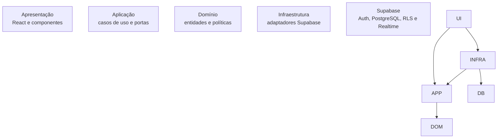
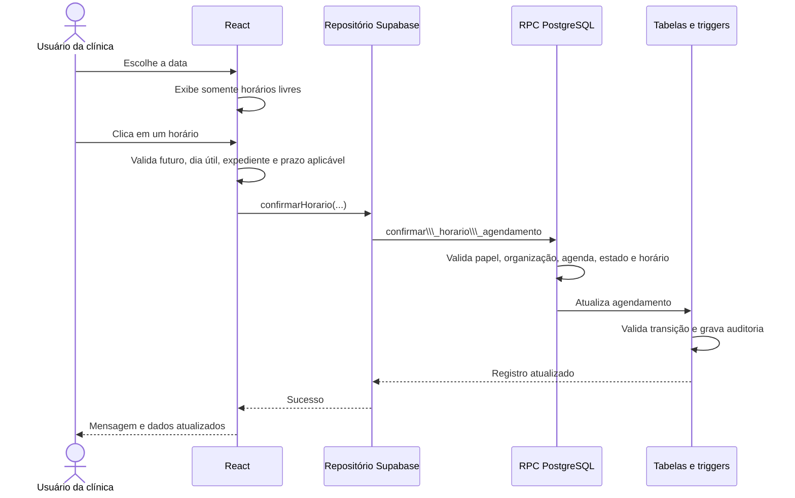
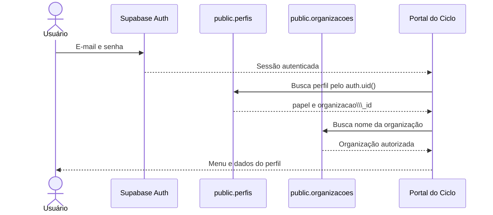
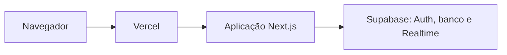

# Ciclo — README técnico

Documentação de arquitetura, infraestrutura, segurança, instalação, execução e manutenção do **Ciclo**, um MVP para gestão de solicitações e agendamentos de exames ocupacionais entre empresas e clínicas.

> Este documento descreve como o software foi construído. Para regras, responsabilidades e jornadas dos usuários, consulte o \\\[README de negócio](./README-NEGOCIO.md).

## Sumário

* [Visão técnica](#visão-técnica)
* [Requisitos de ambiente](#requisitos-de-ambiente)
* [Stack e versões](#stack-e-versões)
* [Arquitetura](#arquitetura)
* [Estrutura de diretórios](#estrutura-de-diretórios)
* [Fluxo de uma operação](#fluxo-de-uma-operação)
* [Banco de dados](#banco-de-dados)
* [Autenticação e autorização](#autenticação-e-autorização)
* [Instalação local](#instalação-local)
* [Preparação do Supabase](#preparação-do-supabase)
* [Comandos do projeto](#comandos-do-projeto)
* [Testes e qualidade](#testes-e-qualidade)
* [Build e hospedagem](#build-e-hospedagem)
* [Segurança](#segurança)
* [Solução de problemas](#solução-de-problemas)
* [Decisões e trade-offs](#decisões-e-trade-offs)

## Visão técnica

O Ciclo é uma aplicação full stack em TypeScript. A interface React acessa o Supabase diretamente com uma chave pública e a sessão do usuário. A segurança não depende de esconder botões: PostgreSQL, Row Level Security (RLS), funções RPC e triggers validam organização, papel, estado e regras temporais.

O código está organizado como um **monólito modular inspirado em Clean Architecture**:

* o domínio contém regras puras e não importa React, Next.js ou Supabase;
* a aplicação expressa casos de uso e contratos de persistência;
* a infraestrutura implementa esses contratos com Supabase;
* a apresentação converte estado e operações em interface React;
* o PostgreSQL repete as validações críticas como última barreira de segurança.

O recorte é administrativo. O sistema não armazena diagnóstico, prontuário, resultado clínico, ASO ou anexos médicos.

## Requisitos de ambiente

|Ferramenta|Requisito|Como conferir|
|-|-|-|
|Node.js|**22.13.0 ou superior**|`node --version`|
|npm|Versão compatível com Node 22 e lockfile v3|`npm --version`|
|Bash|Necessário para `npm run build`|`bash --version`|
|Supabase|Um projeto acessível com Auth e PostgreSQL|Painel do Supabase|

O requisito de Node está declarado em `package.json`:

```json
{
  "engines": {
    "node": ">=22.13.0"
  }
}
```

O npm não está fixado em uma versão única. Use preferencialmente a versão que acompanha o Node.js 22 instalado. O `package-lock.json` usa `lockfileVersion: 3`, e a instalação reproduzível deve ser feita com `npm ci`.

### Instalação do Node com NVM

Linux ou macOS, com o NVM já instalado:

```bash
nvm install 22.13.0
nvm use 22.13.0
node --version
npm --version
```

No Windows, use o instalador oficial do Node.js 22 ou o NVM for Windows. Depois, feche e abra o terminal antes de conferir as versões.

## Stack e versões

As versões abaixo vêm do `package.json` desta entrega.

### Aplicação

|Tecnologia|Versão declarada|Responsabilidade|
|-|-:|-|
|TypeScript|`5.9.3`|Tipagem estática e regras de compilação estritas|
|React|`19.2.6`|Componentes e estado da interface|
|React DOM|`19.2.6`|Renderização no navegador|
|Next.js|`16.2.6`| Framework principal, App Router, renderização, desenvolvimento e build de produção|
|Vite|`8.0.13`|Infraestrutura utilizada pelo Vitest durante os testes|
|Vercel||Hospedagem, CDN e deploy contínuo integrado ao GitHub |
|Supabase JS|`^2.112.1`|Auth, consultas, RPC e Realtime|
|Supabase SSR|`^0.12.4`|Utilitários de integração Supabase|
|Zod|`^4.4.3`|Validação dos dados recebidos da infraestrutura|
|date-fns|`^4.4.0`|Utilitários de data|
|Lucide React|`^1.28.0`|Ícones da interface|
|clsx|`^2.1.1`|Composição condicional de classes|
|tailwind-merge|`^3.6.0`|Normalização de classes utilitárias|

### Qualidade e entrega

|Tecnologia|Versão declarada|Responsabilidade|
|-|-:|-|
|Vitest|`^4.1.10`|Testes unitários e de componentes|
|Testing Library React|`^16.3.2`|Testes orientados ao comportamento da UI|
|Testing Library User Event|`^14.6.3`|Simulação de interações do usuário|
|jsdom|`^29.1.1`|DOM para testes no Node.js|
|ESLint|`9.39.4`|Análise estática|
|eslint-config-next|`16.2.6`|Regras de React, Next e TypeScript|
|Tailwind CSS/PostCSS|`4.2.1`|Pipeline CSS; a identidade visual usa CSS próprio em `app/globals.css`|

## Arquitetura

### Visão em camadas



As dependências centrais apontam para o domínio. A infraestrutura conhece os contratos da aplicação; o domínio não conhece o banco nem a interface.

Existe uma decisão pragmática: `PortalDoCiclo` atua como **composition root** e instancia diretamente `ServicoDeAutenticacaoSupabase` e `RepositorioDoPainelSupabase`. Portanto, a implementação é inspirada em Clean Architecture, mas não pretende ser uma versão acadêmica totalmente desacoplada na camada de apresentação. Em uma evolução, essa composição pode ser movida para um container/factory sem alterar o domínio.

### Onde está a Clean Architecture

|Camada|Local|O que contém|Pode depender de|
|-|-|-|-|
|Domínio|`src/modulos/dominio`|Entidades, estados, políticas, erros e tipos de negócio|TypeScript e código do próprio domínio|
|Aplicação|`src/modulos/agendamentos/aplicacao`|Casos de uso e portas|Domínio e abstrações compartilhadas|
|Infraestrutura|`src/modulos/infraestrutura` e `src/infraestrutura`|Auth, consultas Supabase, RPCs e repositório em memória|Aplicação, domínio e SDKs externos|
|Apresentação|`src/componentes` e `app`|Páginas, modais, feedback, navegação e composição|Aplicação, domínio e infraestrutura no composition root|
|Persistência/segurança|`supabase`|Schema, RLS, RPCs, seed e testes SQL|PostgreSQL/Supabase|

### Módulos

#### Acesso

* `perfil-de-acesso.ts`: páginas permitidas para RH e clínica;
* `perfil-autenticado.ts`: identidade do usuário e helpers de apresentação;
* `servico-de-autenticacao-supabase.ts`: login, logout, sessão, perfil e organização;
* `tela-de-login.tsx`: formulário e estados de autenticação.

#### Agendamentos

* `agendamento-ocupacional.ts`: entidade e transições de estado;
* `politica-de-prazo-ocupacional.ts`: prazo, datas e classificação de atenção;
* `casos-de-uso/`: solicitar, agendar e concluir;
* `portas/repositorio-de-agendamentos.ts`: contrato de persistência;
* `repositorio-de-agendamentos-em-memoria.ts`: adaptador usado em testes;
* `repositorio-do-painel-supabase.ts`: consultas, criação e chamadas RPC reais;
* `tipos-do-painel.ts`: modelos de leitura usados pela interface.

### Componentes principais

|Componente|Responsabilidade|
|-|-|
|`PortalDoCiclo`|Restaura sessão, carrega dados, registra Realtime e conecta UI ao repositório|
|`PainelDoCiclo`|Navegação, indicadores, modais e feedback das operações|
|`ModalNovaSolicitacao`|Entrada do fluxo pelo RH e validação do formulário|
|`ModalAgendarExame`|Definição ou alteração de horário pela clínica|
|`DetalhesDoAgendamento`|Detalhes, histórico e ações válidas conforme papel/status|
|`ModalAgendamentosDoIndicador`|Lista os registros contabilizados em cada indicador|
|`PaginaAgendaClinica`|Pendências, agenda confirmada e acesso ao atendimento|
|`PaginaColaboradores`|Consulta da equipe e abertura de solicitação pelo RH|

O `ModalAgendarExame` recebe a única agenda ativa, **Medicina do Trabalho**, e a seleciona automaticamente. Depois gera candidatos de 30 em 30 minutos entre `08:00` e `17:30` e cruza cada intervalo com os agendamentos `agendado`, usando a regra de sobreposição de intervalo semiaberto `[início, fim)`. Os dados usados nesse filtro já passaram pela RLS e são atualizados por Realtime. Esse filtro melhora a experiência, mas não substitui a constraint de exclusão do PostgreSQL, que continua sendo a proteção final contra reservas simultâneas.

## Estrutura de diretórios

```text
ciclo-ocupacional/
├── app/
│   ├── globals.css                  # Tokens e estilos responsivos
│   ├── layout.tsx                   # Layout raiz
│   └── page.tsx                     # Entrada da aplicação
├── public/                           # Ícones e arquivos públicos
├── scripts/
│   └── criar-usuarios-de-demonstracao.mjs
├── src/
│   ├── compartilhado/               # Relógio, IDs e helpers comuns
│   ├── componentes/                 # Apresentação React
│   ├── infraestrutura/supabase/     # Cliente Supabase do navegador
│   └── modulos/
│       ├── acesso/
│       └── agendamentos/
│           ├── dominio/
│           ├── aplicacao/
│           ├── infraestrutura/
│           └── apresentacao/
├── supabase/
│   ├── migrations/                  # Evolução ordenada do banco
│   ├── testes/                      # Cenários SQL transacionais
│   └── dados-de-demonstracao.sql    # Seed idempotente
├── tests/                            # Testes automatizados
├── package.json
├── package-lock.json
├── README.md
├── README-TECNICO.md
└── README-NEGOCIO.md
```

## Fluxo de uma operação

Exemplo: a clínica confirma um horário.



Há validação em mais de um nível de propósito:

1. o formulário evita erros triviais e dá retorno imediato;
2. o domínio protege regras quando o fluxo é executado em TypeScript;
3. a função RPC executa a alteração crítica de forma transacional;
4. constraints e triggers impedem estados inválidos mesmo se a UI for contornada;
5. RLS limita quais registros a sessão pode ler.

### Matriz de autorização e temporalidade

|Estado e momento|Interface da clínica|Validação no domínio/banco|Ação do RH|
|-|-|-|-|
|`Solicitado`, dentro do prazo|**Definir horário** e **Cancelar**|Primeiro horário exige futuro, dia útil, 30 minutos, expediente, ausência de conflito e data dentro do prazo|Acompanhar ou cancelar|
|`Solicitado`, prazo encerrado|Somente **Cancelar**|RPC recusa o primeiro horário depois da data limite|Acompanhar ou cancelar|
|`Agendado`, antes do início exato|**Reagendar**, **Cancelar** e desfechos desabilitados|RPCs de realizado/falta recusam enquanto `inicio\agendado > now()`|Acompanhar ou cancelar|
|`Agendado`, no instante de início ou depois|**Reagendar**, **Cancelar**, **Não compareceu** e **Marcar como realizado**|RPC valida clínica participante e estado `agendado`|Acompanhar ou cancelar|
|`Não compareceu`|**Reagendar** e **Cancelar**|Reagendamento pode ultrapassar o prazo original, mas ainda exige horário futuro e válido|Acompanhar ou cancelar|
|`Realizado` ou `Cancelado`|Consulta|Triggers impedem retorno a estado operacional|Consulta|

A aplicação compara instantes completos, não apenas o dia do calendário. Um atendimento às `10:00` continua com os desfechos bloqueados às `09:59` e os libera a partir das `10:00`. Horários de expediente e dias úteis são interpretados em `America/Sao Paulo`; os instantes persistidos são `timestamptz` e comparados com `now()` no PostgreSQL.

## Banco de dados

### Modelo principal

```mermaid
erDiagram
    ORGANIZACOES ||--o{ PERFIS : possui
    ORGANIZACOES ||--o{ COLABORADORES : emprega
    ORGANIZACOES ||--o{ RECURSOS\_CLINICA : disponibiliza
    ORGANIZACOES ||--o{ AGENDAMENTOS\_OCUPACIONAIS : participa
    COLABORADORES ||--o{ AGENDAMENTOS\_OCUPACIONAIS : recebe
    RECURSOS\_CLINICA o|--o{ AGENDAMENTOS\_OCUPACIONAIS : aloca
    AGENDAMENTOS\_OCUPACIONAIS ||--o{ EVENTOS\_AGENDAMENTO : registra

    ORGANIZACOES {
        uuid id PK
        text nome
        enum tipo
        boolean ativo
    }

    PERFIS {
        uuid id PK
        uuid organizacao\_id FK
        text nome\_completo
        enum papel
    }

    COLABORADORES {
        uuid id PK
        uuid empresa\_id FK
        text nome\_completo
        text cpf
        text matricula
        text cargo
    }

    RECURSOS\_CLINICA {
        uuid id PK
        uuid clinica\_id FK
        text nome
        int duracao\_padrao\_minutos
    }

    AGENDAMENTOS\_OCUPACIONAIS {
        uuid id PK
        uuid empresa\_id FK
        uuid clinica\_id FK
        uuid colaborador\_id FK
        uuid recurso\_clinica\_id FK
        enum tipo\_exame
        enum status
        date data\_referencia
        date data\_limite
        timestamptz inicio\_agendado
        timestamptz fim\_agendado
    }

    EVENTOS\_AGENDAMENTO {
        uuid id PK
        uuid agendamento\_id FK
        enum status\_anterior
        enum status\_atual
        text descricao
        timestamptz ocorrido\_em
    }
```

`organizacoes.tipo` diferencia empresa e clínica. Um agendamento guarda simultaneamente `empresa\id` e `clinica\id`; por isso a mesma tabela pode ser consultada pelos dois participantes sem duplicar o processo.

### Proteções de integridade

* colaborador precisa pertencer à empresa do agendamento;
* recurso precisa pertencer à clínica do agendamento;
* empresa e clínica devem ser organizações distintas;
* retorno ao trabalho exige `dias\afastamento >= 30`;
* agendamento confirmado exige recurso, início e fim coerentes;
* a primeira marcação exige horário futuro dentro da data limite ocupacional;
* reagendamentos de estados `agendado` ou `nao\compareceu` podem ultrapassar o prazo original, sem alterar esse prazo nem retirar a classificação de atraso;
* o início precisa cair em uma grade de 30 minutos;
* início e término precisam ocorrer de segunda a sexta-feira;
* início e término precisam permanecer no expediente entre `08:00` e `18:00`;
* cancelamento exige motivo entre cinco e 180 caracteres;
* realização exige `realizado\em`;
* realizado e não comparecimento exigem que o horário exato de início já tenha chegado;
* um recurso clínico não pode ter dois horários `agendado` sobrepostos;
* não pode existir outra solicitação aberta equivalente para o mesmo colaborador, tipo e referência;
* campos de origem do pedido não podem ser alterados depois da criação;
* estados finais não podem voltar para estados operacionais.

### Funções RPC

|Função|Quem executa|Finalidade|
|-|-|-|
|`listar\colaboradores\autorizados()`|RH e clínica autenticados|Retorna somente colaboradores relacionados e apenas os dois últimos dígitos do CPF|
|`confirmar\horario\agendamento(...)`|Clínica|Exige o prazo na primeira marcação e permite reagendar fluxos já agendados ou com falta, preservando futuro, duração, dia útil, expediente e conflito|
|`concluir\agendamento(uuid)`|Clínica|Marca como realizado somente no instante de início ou depois dele|
|`registrar\nao\comparecimento(uuid)`|Clínica|Registra ausência somente no instante de início ou depois dele|
|`cancelar\agendamento(uuid, text)`|RH ou clínica participante|Encerra fluxo aberto com justificativa|
|`organizacao\do\usuario()`|Sessão autenticada|Resolve a organização para as policies|
|`papel\do\usuario()`|Sessão autenticada|Resolve RH ou clínica para as policies/RPCs|

### Auditoria e Realtime

Triggers gravam em `eventos\agendamento` a criação, confirmação, reagendamento, realização, ausência e cancelamento. A interface assina mudanças de `agendamentos\ocupacionais` pelo Supabase Realtime, filtrando `empresa\id` para RH ou `clinica\id` para clínica. Existe também o botão de atualização manual como contingência.

## Autenticação e autorização



O papel não é inferido pelo e-mail e não existe seletor manual de perfil. O usuário precisa existir no Supabase Auth e possuir uma linha correspondente em `public.perfis`.

### Camadas de autorização

|Camada|Função|
|-|-|
|Supabase Auth|Confirma identidade e emite a sessão|
|`public.perfis`|Liga `auth.users.id` à organização e ao papel|
|Interface|Mostra apenas menus e ações pertinentes ao papel|
|RLS|Restringe linhas pela organização da sessão|
|RPCs|Validam quem pode executar cada transição|
|Triggers/constraints|Impedem estados inválidos independentemente do cliente|

## Instalação local

### 1\. Entre na pasta do projeto

Windows CMD:

```bat
cd /d "C:\Users\User\Documents\ciclo-ocupacional-repositorio\ciclo-ocupacional"
```

Linux, macOS ou Git Bash:

```bash
cd /caminho/para/ciclo-ocupacional
```

### 2\. Confira o Node

```bash
node --version
npm --version
```

O Node precisa retornar `v22.13.0` ou uma versão superior.

### 3\. Instale as dependências

```bash
npm ci
```

Use `npm ci`, e não `npm install`, para respeitar exatamente o `package-lock.json`. A pasta `node\modules` não acompanha o ZIP.

### 4\. Crie o ambiente local

Windows CMD:

```bat
copy .env.example .env.local
notepad .env.local
```

Linux, macOS ou Git Bash:

```bash
cp .env.example .env.local
```

Conteúdo mínimo:

Configure as variáveis de ambiente

Abra o arquivo `.env.local`. Inicialmente, ele estará com as variáveis sem preenchimento:

```env
NEXT_PUBLIC_MODO_DEMONSTRACAO=
NEXT_PUBLIC_URL_DA_APLICACAO=
NEXT_PUBLIC_SUPABASE_URL=
NEXT_PUBLIC_SUPABASE_ANON_KEY=
```

Para executar o projeto conectado ao ambiente de demonstração, preencha o arquivo da seguinte forma:

```env
NEXT_PUBLIC_MODO_DEMONSTRACAO=true
NEXT_PUBLIC_URL_DA_APLICACAO=http://localhost:3000
NEXT_PUBLIC_SUPABASE_URL=https://fwcewlxktzatfuuwpwwm.supabase.co
NEXT_PUBLIC_SUPABASE_ANON_KEY=sb_publishable_kovEIcV8OyHRZkB8xcVp7g_n-wJYJnS

SUPABASE_SERVICE_ROLE_KEY=sb_secret_8b8bQVegg7oT7CsK1nOtPw_iY93c2av
```

### 5\. Inicie o desenvolvimento

```bash
npm run dev
```

Abra [http://localhost:5173](http://localhost:5173). Se o Vite escolher outra porta porque `5173` está ocupada, use a URL exibida no terminal.

Para encerrar, volte ao terminal e pressione `Ctrl + C`.

### Acessos fictícios

|Perfil|E-mail|Senha|
|-|-|-|
|RH|`rh@ciclo.test`|`CicloRH#2026!`|
|Clínica|`clinica@ciclo.test`|`CicloClinica#2026!`|

Esses acessos são exclusivos do ambiente demonstrativo.

## Comandos do projeto

|Comando|O que faz|
|-|-|
|`npm ci`|Instala exatamente as versões do lockfile|
|`npm run dev`|Inicia o servidor de desenvolvimento do Next.js|
|`npm run start`|Inicia a aplicação compilada com Next.js|
|`npm run build`|Gera o build otimizado de produção com Next.js|
|`npm run lint`|Executa ESLint|
|`npm run typecheck`|Executa TypeScript sem emitir arquivos|
|`npm test`|Executa a suíte Vitest uma vez|
|`npm run test:coverage`|Gera cobertura V8 em texto e HTML|
|`npm run check`|Executa lint, typecheck e testes|
|`npm run demo:usuarios`|Cria/atualiza os usuários fictícios via Admin API|

Os comandos do projeto utilizam diretamente o Node.js, o npm e o Next.js e podem ser executados no Windows, Linux ou macOS.

## Testes e qualidade

### Verificação completa

```bash
npm run check
```

A suíte atual contém **48 casos Vitest** no código, executados pelo fluxo de verificação do projeto.

### Escopo dos testes

* permissões de páginas para RH e clínica;
* login, credenciais e perfil autenticado;
* iniciais do avatar;
* criação de solicitação e primeiro evento;
* bloqueio de solicitação aberta duplicada;
* transições de status;
* datas passadas, prazo demissional e retorno após 30 dias;
* bloqueio de sábado, domingo, atendimento fora do expediente e início fora da grade de 30 minutos;
* seleção automática da agenda única Medicina do Trabalho;
* grade clicável com ocultamento de intervalos ocupados e duração fixa de 30 minutos;
* bloqueio da primeira marcação depois do prazo;
* sobreposição do mesmo recurso clínico;
* bloqueio de desfecho antes da data e hora exatas do início;
* reagendamento depois de falta, inclusive após o prazo original;
* permanência de **Reagendar** e **Cancelar** em `Não compareceu`, sem repetir os botões de desfecho;
* cancelamento com justificativa;
* indicadores clicáveis para RH e clínica;
* abertura de detalhes e ações exclusivas da clínica;
* feedback de atualização;
* responsividade lógica dos fluxos de apresentação.

### Runtime de produção



A aplicação utiliza o Next.js com App Router e é publicada na Vercel. O navegador acessa a aplicação hospedada e se comunica com o Supabase para autenticação, persistência e atualizações em tempo real.

## Segurança

### Controles implementados

* Supabase Auth com e-mail e senha;
* perfil e organização resolvidos pelo `auth.uid()`;
* RLS habilitado em todas as tabelas operacionais;
* nenhuma permissão de tabela para `anon`;
* operações críticas por funções `security definer` com `search\path` explícito;
* validação de papel e organização dentro das RPCs;
* constraints e triggers para integridade e transição;
* auditoria operacional por evento;
* CPF completo sem `SELECT` para o papel `authenticated`;
* RPC de colaboradores retorna somente os dois últimos dígitos do CPF;
* chaves secretas ignoradas pelo Git;
* nenhuma informação médica no modelo.

### Porta `5173` ocupada

Encerre o servidor anterior com `Ctrl + C` ou abra a nova URL mostrada pelo Vite. Também é possível iniciar em outra porta:

```bash
npm run dev -- --port 5174
```

### `bash` não encontrado no Windows

Instale Git for Windows e execute os comandos de qualidade/build no Git Bash, ou use WSL. O servidor de desenvolvimento pode ser iniciado normalmente pelo terminal com `npm run dev`.

## Decisões

|Decisão|Justificativa|Consequência|
|-|-|-|
|Monólito modular|Proporcional ao tamanho do MVP|Deploy simples, com limites internos claros|
|Clean Architecture pragmática|Mantém domínio testável sem excesso de abstração|Composition root ainda conhece adaptadores concretos|
|Supabase como backend|Auth, PostgreSQL, RLS e Realtime integrados|Aplicação depende da disponibilidade do projeto Supabase|
|RPCs para comandos críticos|Transação e autorização no banco|Regras precisam ser mantidas coerentes entre TS e SQL|
|Validação duplicada|Boa UX e segurança contra cliente contornado|Exige testes para evitar divergência|
|Realtime + atualização manual|Atualização rápida com contingência|Não existe fila garantida nem notificação externa|
|Uma agenda clínica ativa|**Medicina do Trabalho** resolve duração, grade de 30 minutos, dias úteis, expediente fixo e conflito no MVP|O modelo ainda preserva `recursos\clinica` para evolução, mas não oferece escolha entre agendas na interface|
|CPF reduzido no banco|Minimiza dado pessoal exposto ao navegador|Consultas precisam usar a RPC autorizada|
|Sem prontuário|Mantém o recorte administrativo e reduz risco|Conteúdo médico exige outro módulo e governança própria|

\---

Documentação complementar: [README de negócio](./README-NEGOCIO.md) · [Uso de IA](./README-USO-IA.md) · [README principal](./README.md)
