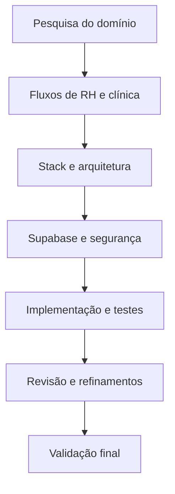
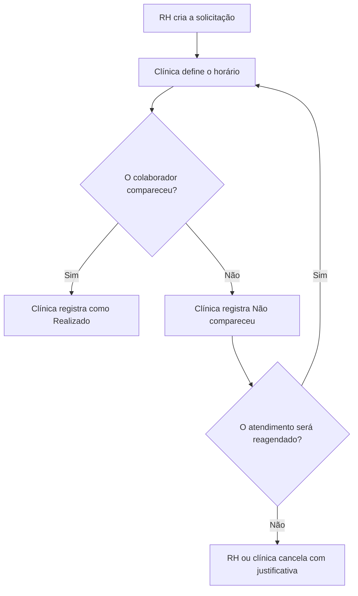
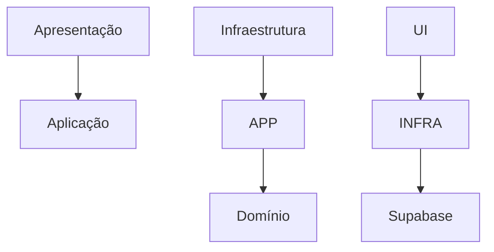

# Ciclo — Uso de Inteligência Artificial

Este documento descreve de forma transparente como utilizei Inteligência Artificial durante a concepção, implementação e revisão do **Ciclo**.

> A IA foi utilizada como ferramenta de pesquisa, exploração de alternativas, revisão e documentação. As decisões de produto e arquitetura, a validação das regras, a configuração do ambiente e a responsabilidade pela entrega permaneceram humanas.

## Resumo

O uso da IA aconteceu de forma incremental:

1. pesquisa inicial sobre o contexto administrativo da medicina ocupacional;
2. modelagem dos fluxos e responsabilidades de RH e clínica;
3. definição da linguagem e da stack;
4. desenho da arquitetura do software;
5. modelagem e proteção do banco de dados no Supabase;
6. implementação assistida do código e dos testes;
7. execução, análise de erros e refinamento da experiência;
8. simplificação do recorte para manter o núcleo do desafio funcional de ponta a ponta.



## Ferramentas utilizadas

Utilizei **ChatGPT como apoio ao desenvolvimento. As ferramentas foram empregadas para:

* organizar a pesquisa inicial;
* questionar e refinar regras de negócio;
* comparar alternativas técnicas;
* auxiliar na melhoria e revisão de TypeScript, React e SQL;
* estruturar migrations, policies RLS, funções RPC e testes;
* analisar mensagens de erro durante a configuração local e do Supabase;
* revisar a interface e os fluxos dos dois perfis;
* produzir e manter a documentação técnica e funcional.

## 1\. Pesquisa inicial sobre medicina ocupacional

O primeiro uso da IA foi exploratório. Pesquisei o funcionamento geral de uma jornada administrativa de saúde ocupacional para compreender:

* como uma empresa solicita um exame para um colaborador;
* como a clínica recebe e organiza essa solicitação;
* quais informações são administrativas e quais pertencem ao contexto médico;
* quais tipos de exame precisariam de datas de referência diferentes;
* quais estados seriam necessários para acompanhar o processo.

Essa pesquisa ajudou a definir um limite importante: o Ciclo administra **solicitações, agenda e comparecimento**, mas não prontuário, diagnóstico, resultado médico, aptidão, ASO ou laudos.

O conteúdo obtido com IA foi tratado como apoio para modelagem do MVP, não como parecer médico ou jurídico. As premissas adotadas e os limites do recorte foram registrados no [README de negócio](./README-NEGOCIO.md).

## 2\. Definição dos fluxos de RH e clínica

Depois da pesquisa, utilizei a IA para decompor a jornada entre os dois participantes e identificar quem deveria executar cada ação.

|Perfil|Responsabilidades definidas|
|-|-|
|RH|Criar a solicitação, informar o contexto administrativo, acompanhar estados e histórico e cancelar um fluxo aberto quando necessário|
|Clínica|Receber a solicitação, definir ou alterar o horário, registrar realização ou ausência e cancelar quando houver uma razão operacional|

Essa etapa também revelou que os papéis não poderiam ser apenas abas ou um seletor visual. O sistema precisava identificar o perfil pelo login e proteger os dados pela organização.

O fluxo resultante foi:



## 3\. Definição da linguagem e da stack

Com o fluxo delimitado, usei a IA para avaliar uma stack proporcional ao prazo e ao objetivo do desafio. A linguagem escolhida foi **TypeScript**, permitindo compartilhar conceitos e validações entre domínio, aplicação e interface.

A solução foi construída com:

|Tecnologia|Uso no projeto|
|-|-|
|TypeScript|Tipagem, domínio, casos de uso e componentes|
|React|Interface e interação dos perfis|
|Next.js/Vinext/Vite|Estrutura da aplicação, desenvolvimento e build|
|Supabase JS|Autenticação, consultas, RPCs e Realtime|
|PostgreSQL|Persistência, integridade e regras críticas|
|Vitest e Testing Library|Testes de domínio, aplicação e interface|

O Supabase também foi escolhido porque já utilizo uma conta paga na plataforma para hospedar alguns projetos pessoais. Como sua infraestrutura fica disponível na nuvem sobre a AWS, destinei parte dos recursos dessa conta ao projeto Ciclo, facilitando o acesso e os testes da aplicação pelos avaliadores.

A IA ajudou a comparar opções e verificar compatibilidades, mas a escolha considerou principalmente o tempo disponível, a necessidade de demonstrar um fluxo completo e a possibilidade de manter todo o projeto em uma única base TypeScript.

## 4\. Definição da arquitetura

Na etapa seguinte, utilizei a IA para discutir separação de responsabilidades e evitar que regras importantes ficassem presas aos componentes React.

Foi adotado um **monólito modular inspirado em Clean Architecture**:



* **Domínio:** estados, transições, prazos e validações puras;
* **Aplicação:** casos de uso e contratos de persistência;
* **Infraestrutura:** implementação dos contratos e integração com Supabase;
* **Apresentação:** páginas, componentes, modais e feedback;
* **Banco:** RLS, RPCs, constraints, triggers e auditoria.

A IA também foi usada para questionar o nível de abstração. A decisão final foi manter uma Clean Architecture pragmática, adequada ao MVP, em vez de introduzir complexidade apenas para reproduzir uma estrutura acadêmica.

## 5\. Banco de dados e escolha do Supabase

O **Supabase** foi escolhido porque eu já possuía uma conta e porque a plataforma reunia recursos necessários ao desafio:

* autenticação por e-mail e senha;
* PostgreSQL;
* Row Level Security;
* funções RPC transacionais;
* Realtime;
* ambiente simples para aplicar migrations e dados demonstrativos.

A IA auxiliou na modelagem das tabelas, no relacionamento entre empresa, clínica, perfil, colaborador, agenda, agendamento e histórico, além da criação incremental de:

* migrations SQL;
* policies RLS;
* funções RPC para operações críticas;
* triggers de transição e auditoria;
* restrições de integridade e conflito de agenda;
* script de usuários demonstrativos;
* seed idempotente;
* testes SQL executados dentro de transação com `ROLLBACK`.

As decisões de segurança foram verificadas em mais de uma camada. A interface controla a experiência, mas papel, organização, status, prazo, horário e conflito também são validados no PostgreSQL.

## 6\. Refinamentos, erros encontrados e melhorias

|Situação inicial|Problema identificado|Refinamento aplicado|
|-|-|-|
|Troca manual entre RH e clínica|Não representava usuários reais nem autorização|Login com Supabase Auth, perfil em `public.perfis` e isolamento por RLS|
|Tela inicial muito explicativa|Parecia apresentação de funcionalidades, não entrada de um produto real|Painel institucional simplificado e formulário de login em destaque|
|Indicadores apenas informativos|O usuário não conseguia descobrir quais registros formavam o total|Cards clicáveis, modal com a lista contabilizada e acesso aos detalhes|
|Mais de uma agenda demonstrativa|Aumentava a complexidade sem agregar valor ao núcleo do teste|Uma única agenda ativa: **Medicina do Trabalho**|
|Campo de horário livre|Permitiria tentativas inválidas e exigiria mais interpretação|Grade clicável de 30 minutos, mostrando somente horários disponíveis|
|Agendamento em qualquer dia|Não representava o expediente definido para o MVP|Bloqueio de sábado, domingo, passado e horários fora de `08:00–18:00`|
|Regra descrita apenas como “no dia”|Poderia liberar o desfecho antes do horário marcado|`Realizado` e `Não compareceu` liberados somente a partir da data e hora exatas|
|Prazo bloqueava todo o fluxo depois de uma falta|Impedia resolver uma ausência já registrada|Reagendamento permitido após `Não compareceu`, mesmo com prazo original vencido|
|Reagendamento poderia esconder o atraso|Perderia a rastreabilidade ocupacional|Prazo original preservado e fluxo mantido como atrasado|
|Ações pouco claras por estado|Clínica e RH poderiam interpretar responsabilidades de forma diferente|Matriz explícita de ações por perfil, status e momento|

Esse processo reduziu a complexidade acidental e concentrou o projeto no que a avaliação precisava comprovar: um fluxo pequeno, seguro e realmente funcional de ponta a ponta.

## 7. Exemplos de solicitações feitas à IA

Ao longo do desenvolvimento, as solicitações feitas à IA tornaram-se progressivamente mais específicas, acompanhando a evolução das regras e do fluxo da aplicação. Alguns exemplos resumidos foram:

- pesquisar referências e organizar o fluxo administrativo dos exames ocupacionais;
- revisar a divisão de responsabilidades entre RH e clínica;
- analisar a coerência da arquitetura com as regras de negócio definidas;
- revisar as transições de status implementadas no código e no banco de dados;
- avaliar melhorias para tornar os indicadores de RH e clínica clicáveis e acessíveis;
- revisar as regras que impedem agendamentos aos finais de semana e organizam os horários em intervalos de 30 minutos;
- analisar a identificação de horários ocupados e a simplificação do sistema para uma única agenda;
- revisar a regra que permite registrar `Realizado` ou `Não compareceu` somente após o início do horário agendado;
- avaliar o fluxo de reagendamento após uma ausência, preservando o prazo ocupacional originalmente informado;
- revisar a clareza, a organização e a consistência dos READMEs técnico, de negócio e de uso de IA.

As respostas da IA foram utilizadas como material de apoio e passaram por avaliação antes de serem incorporadas ao projeto. As alterações foram acompanhadas por testes automatizados, inspeção do comportamento da interface e novas correções sempre que o resultado ainda não representava adequadamente a regra de negócio definida.

## 8\. Validação e revisão crítica

A IA também apoiou a criação da estratégia de testes, mas a aprovação da entrega não dependeu da resposta textual do modelo. O projeto foi validado por comandos reproduzíveis:

```bash
npm run check
npm run build
```

Na versão final:

* lint aprovado;
* TypeScript aprovado;
* **48 testes Vitest aprovados**;
* build de produção aprovado;
* migrations ordenadas e documentadas;
* teste SQL de segurança e fluxo disponível com `ROLLBACK`;
* arquivos secretos e `.env.local` excluídos do pacote de entrega.

Os testes cobrem autenticação, permissões, criação da solicitação, transições, prazos, dias úteis, expediente, intervalos de 30 minutos, conflito de agenda, indicadores clicáveis, feedback e reagendamento após não comparecimento.

## 9. Decisões e responsabilidade humana

Na etapa de codificação, a IA foi utilizada como apoio à revisão técnica, ajudando a identificar inconsistências, melhorar a legibilidade, reforçar validações e sugerir ajustes pontuais. A análise e a aplicação dessas sugestões permaneceram sob responsabilidade humana.

Permaneceram sob decisão, implementação e revisão humana:

- definição do problema que seria resolvido;
- escolha do recorte administrativo;
- divisão de responsabilidades entre RH e clínica;
- escolha do Supabase por adequação técnica e disponibilidade da conta;
- avaliação das propostas de arquitetura;
- desenvolvimento e codificação das regras de negócio;
- organização dos componentes e das camadas da aplicação;
- aprovação, adaptação ou rejeição das sugestões apresentadas pela IA;
- execução das migrations e configuração do ambiente;
- inspeção visual e funcional da aplicação;
- proteção e revogação das chaves administrativas;
- decisão final sobre regras, exceções e simplificações;
- validação da entrega por meio dos testes automatizados e do build de produção.

A IA acelerou pesquisa, implementação e revisão, mas não substituiu entendimento do problema, julgamento técnico ou responsabilidade sobre o resultado.

## Resultado

O uso da IA permitiu começar pela compreensão do problema e evoluir até uma solução testável, sem perder a separação entre negócio, arquitetura e implementação. O maior ganho foi comparar alternativas rapidamente, identificar inconsistências e refinar o fluxo até que RH e clínica tivessem responsabilidades claras, segurança no banco e uma experiência simples.

\---

Documentação complementar: [README principal](./README.md) · [README técnico](./README-TECNICO.md) · [README de negócio](./README-NEGOCIO.md)

