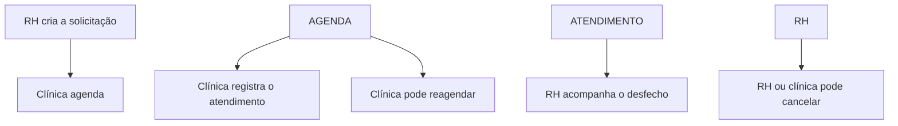

# Ciclo — Gestão de Agendamentos Ocupacionais

Aplicação full stack para organizar solicitações, agendamentos e o acompanhamento administrativo de exames ocupacionais entre empresas e clínicas.

A documentação foi dividida em três READMEs para facilitar a leitura e a organização.

## Documentação

|Documento|Conteúdo|
|-|-|
|[README técnico](./README-TECNICO.md)|Arquitetura, Clean Architecture, stack, versões, banco, Supabase, RLS, instalação, execução, testes, build, segurança|
|[README de negócio](./README-NEGOCIO.md)|Fluxos separados de RH e clínica, responsabilidades, estados, prazos, indicadores, exceções e diagramas Mermaid|
|[README de uso de IA](./README-USO-IA.md)|Pesquisa do domínio, decisões assistidas, evolução do fluxo, correções, validação e limites do uso de Inteligência Artificial|

## Fluxo resumido



## Como instalar e executar o projeto localmente

Você pode clonar o repositório com o Git ou fazer o download pelo botão **Code → Download ZIP** do GitHub.

### 1. Clone o repositório

```bash
git clone https://github.com/StephanieGadoniS/ciclo-ocupacional.git
cd ciclo-ocupacional
```

Caso tenha baixado o arquivo ZIP, extraia-o e abra o terminal dentro da pasta que contém o arquivo `package.json`.

### 2. Verifique o Node.js

```bash
node --version
npm --version
```

O projeto requer **Node.js 22.13.0 ou superior**.

### 3. Instale as dependências

```bash
npm ci
```

Esse comando utiliza o `package-lock.json` para instalar as versões exatas das dependências do projeto.

### 4. Configure as variáveis de ambiente

Crie o arquivo `.env.local` a partir do exemplo disponível no repositório.

No Windows CMD:

```bat
copy .env.example .env.local
```

No Linux, macOS ou Git Bash:

```bash
cp .env.example .env.local
```

### Configure as variáveis de ambiente

Abra o arquivo `.env.local`. Inicialmente, ele estará com as variáveis sem preenchimento:

Abra o arquivo `.env.local`. Inicialmente, ele estará com as variáveis sem preenchimento:

```env
NEXT_PUBLIC_MODO_DEMONSTRACAO=
NEXT_PUBLIC_URL_DA_APLICACAO=
NEXT_PUBLIC_SUPABASE_URL=
NEXT_PUBLIC_SUPABASE_ANON_KEY=
```

Para executar o projeto conectado ao ambiente de demonstração, preencha o arquivo da seguinte forma:

```env
NEXT_PUBLIC_MODO_DEMONSTRACAO=true
NEXT_PUBLIC_URL_DA_APLICACAO=http://localhost:3000
NEXT_PUBLIC_SUPABASE_URL=https://fwcewlxktzatfuuwpwwm.supabase.co
NEXT_PUBLIC_SUPABASE_ANON_KEY=sb_publishable_kovEIcV8OyHRZkB8xcVp7g_n-wJYJnS

SUPABASE_SERVICE_ROLE_KEY=sb_secret_8b8bQVegg7oT7CsK1nOtPw_iY93c2av
```


### 5. Inicie a aplicação

```bash
npm run dev
```

Quando o terminal informar que o servidor está pronto, acesse:

[http://localhost:5173](http://localhost:5173)

### Acessos de demonstração

Na tela inicial, selecione um dos perfis:

* **RH:** `rh@ciclo.test`
* **Clínica:** `clinica@ciclo.test`

As senhas são preenchidas automaticamente ao selecionar o perfil desejado.

### 6. Valide o projeto

Para executar o lint, a verificação do TypeScript e os testes automatizados:

```bash
npm run check
```

Para gerar e validar o build de produção:

```bash
npm run build
```

> No Windows, os comandos de validação que utilizam scripts Bash devem ser executados pelo Git Bash ou WSL.

### Segurança

O arquivo `.env.local`, as chaves do Supabase, a pasta `node\modules` e os artefatos de build não acompanham o repositório.

## Limite funcional

O Ciclo armazena somente informações administrativas relacionadas às solicitações e aos agendamentos. Prontuários, diagnósticos, resultados médicos, ASOs e anexos clínicos não fazem parte deste MVP.

O arquivo .env.local, as chaves do Supabase e a pasta node\modules não acompanham o repositório e não devem ser enviados ao GitHub.

## Próximos passos

Para manter o projeto concentrado no fluxo principal de solicitação, agendamento e acompanhamento dos exames, algumas funcionalidades administrativas ficaram fora do escopo desta entrega. Elas representam os próximos passos naturais para a evolução do sistema:

* **Cadastro de empresas e clínicas:** permitir a criação de novas organizações, seus dados cadastrais e a vinculação dos respectivos usuários de RH e clínica;
* **Gestão de acessos:** possibilitar convites, alteração de perfil, ativação, inativação e recuperação de acesso dos usuários;
* **Cadastro de colaboradores:** permitir que o RH inclua novos colaboradores diretamente pelo sistema, individualmente ou por importação;
* **Manutenção dos cadastros:** disponibilizar consulta, edição, inativação e histórico de alterações de empresas, clínicas, usuários e colaboradores;
* **Gestão do vínculo empregatício:** registrar admissão, situação atual, mudança de função e desligamento do colaborador;
* **Encadeamento dos exames ocupacionais:** validar quais exames podem ser solicitados de acordo com o vínculo e o histórico do colaborador;
* **Regras específicas por tipo de exame:** tratar separadamente exames admissionais, periódicos, de retorno ao trabalho, de mudança de risco ocupacional e demissionais;
* **Validação da sequência dos exames:** impedir combinações incoerentes, como solicitar um exame demissional para um colaborador sem vínculo ativo ou sem histórico de admissão, considerando também exceções para cadastros importados de sistemas anteriores;
* **Controle de prazos ocupacionais:** aplicar regras de prazo específicas para cada tipo de exame, de acordo com o contexto administrativo informado.

Com essas evoluções, o Ciclo deixaria de atender apenas ao fluxo operacional do agendamento e passaria a acompanhar toda a jornada ocupacional do colaborador, desde sua admissão até o encerramento do vínculo.

